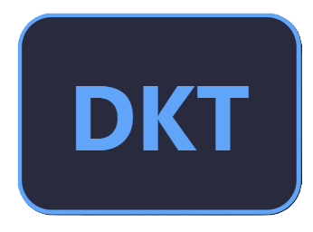

# Dayak Kenyah Translator Pro

<div align="center">
    
    <h3>Melestarikan Bahasa Dayak Kenyah Melalui Teknologi Modern</h3>
</div>

## 🌟 Tentang Proyek

Dayak Kenyah Translator Pro adalah sebuah aplikasi penerjemah dwi-arah antara Bahasa Indonesia dan Bahasa Dayak Kenyah. Proyek ini bertujuan untuk melestarikan bahasa daerah melalui teknologi modern dan membuat bahasa Dayak Kenyah lebih mudah diakses oleh generasi muda.

### ✨ Fitur Utama

- 🔄 Terjemahan dwi-arah (Indonesia ↔ Dayak Kenyah)
- 💡 Pencocokan kata multi-kata cerdas
- 🌙 Mode Gelap/Terang
- 📱 Responsif untuk semua perangkat
- ⚡ Performa tinggi dengan pemrosesan lokal
- 🔌 Tersedia dalam versi ESP32 dan Local Host

## 🚀 Memulai

### Prasyarat

- Python 3.8+
- Node.js 14+
- Docker (opsional)

### Instalasi

```bash
# Clone repositori
git clone https://github.com/yourusername/dayak-kenyah-translator-pro.git
cd dayak-kenyah-translator-pro

# Instalasi dependensi
pip install -r requirements.txt

# Jalankan aplikasi
python main.py
```

### Menggunakan Docker

Aplikasi ini mendukung deployment menggunakan Docker dengan dua opsi: CPU-only dan GPU-accelerated (CUDA). Pilih mode yang sesuai dengan perangkat keras Anda.

#### Prasyarat untuk GPU Mode
- [NVIDIA GPU Driver](https://www.nvidia.com/Download/index.aspx)
- [NVIDIA Container Toolkit](https://docs.nvidia.com/datacenter/cloud-native/container-toolkit/install-guide.html)
- Docker dengan GPU support

#### Build Image

```bash
# Build untuk CPU (default)
docker build -t dayak-translator .

# Build untuk GPU/CUDA
docker build --build-arg USE_CUDA=1 -t dayak-translator-gpu .
```

#### Menjalankan Container

```bash
# Menjalankan versi CPU
docker run -d --name dayak-translator -p 8000:8000 dayak-translator

# Menjalankan versi GPU
docker run -d --name dayak-translator-gpu --gpus all -p 8000:8000 dayak-translator-gpu
```

#### Fitur Docker

- 🔄 Auto-detection GPU/CPU mode
- 🛡️ Security-enhanced dengan non-root user
- 🏗️ Multi-stage build untuk image size optimal
- 🔍 Built-in health check
- 📊 Environment variable customization

#### Environment Variables

| Variable | Description | Default |
|----------|-------------|---------|
| `PORT` | Port untuk aplikasi web | 8000 |
| `USE_CUDA` | Enable/disable GPU acceleration | 0 (CPU) or 1 (GPU) |
| `PYTHONUNBUFFERED` | Python output buffering | 1 |

#### Monitoring Container

```bash
# Cek status container
docker ps -a

# Lihat logs
docker logs dayak-translator

# Cek resource usage
docker stats dayak-translator
```

#### Troubleshooting

1. GPU Mode
```bash
# Verifikasi GPU detection
docker run --gpus all nvidia/cuda:12.0.0-base-ubuntu22.04 nvidia-smi
```

2. Container Logs
```bash
# Lihat detailed logs
docker logs -f dayak-translator
```

3. Health Check
```bash
# Cek status container dan health
docker inspect dayak-translator | grep -i health
```

## 🛠️ Teknologi

- Python (Backend)
- HTML5, CSS3, JavaScript (Frontend)
- Docker
- ESP32 (untuk versi embedded)

## 📖 API Documentation

### Endpoint Utama

- `POST /translate`
  - Body: `{"text": "text to translate", "direction": "id2dyk|dyk2id"}`
  - Response: `{"result": "translated text"}`

## 🤝 Kontribusi

Kontribusi selalu diterima! Lihat [CONTRIBUTING.md](CONTRIBUTING.md) untuk panduan.

## 📝 Lisensi

Proyek ini dilisensikan di bawah Lisensi MIT - lihat file [LICENSE](LICENSE) untuk detail.

## 👏 Pengakuan

Proyek ini adalah pengembangan dari:
- [Dayak Kenyah Translator ESP32](https://github.com/RyuHiiragi/Dayak-Kenyah-Translator-ESP-32.git) oleh Muhammad Rizky Saputra
- [Dayak Kenyah Translator Local](https://github.com/stdnt-c1/Dayak-Kenyah-Translator-Local-Optimized.git) oleh Muhammad Bilal Maulida

## 📞 Kontak

- Instagram: [@kysukamieayam](https://instagram.com/kysukamieayam)
- GitHub: [@RyuHiiragi](https://github.com/RyuHiiragi)
